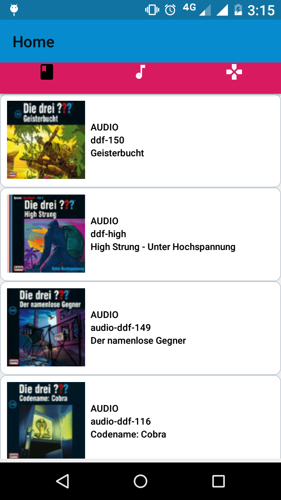

# Android RecyclerView example in Fragments
## Steps
- 1)Add below dependency in gradle.properties
## Screens
![Alt text][https://github.com/vijaylaxmidubey/RecyclerView-in-fragment/blob/master/screenshots/device-2019-08-15-151351.png]

![Alt text][screenshots/device-2019-08-15-151555.png]